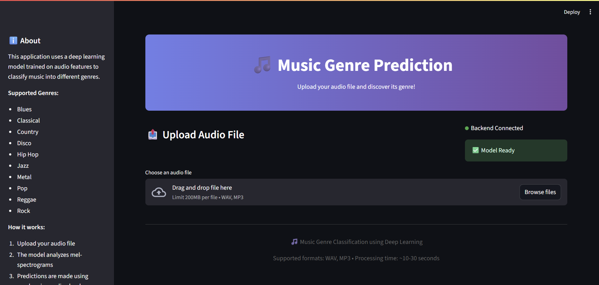

---

# 🎵 Music Genre Classification

A **complete end-to-end machine learning project** for classifying music into different genres using deep learning, audio signal processing, and a web-based interface.

This project leverages **Librosa** for audio feature extraction, **TensorFlow/Keras** for training a convolutional neural network (CNN) on mel-spectrograms, **Flask** for the backend API, and **Streamlit** for the frontend web app.

---

## 📂 Project Structure

```
music-ml-app/
│
├── app/
│   ├── backend/
│   │   └── api.py                # Flask API for serving predictions
│   ├── frontend/
│   │   └── app.py                # Streamlit frontend application
│
├── models/
│   └── Trained_model_Music_Genre_Class.h5  # Trained CNN model
│   └── Trained_model_Music_Genre_Class.keras
│   └── Trained_model_Music_Genre_Class.json
├── notebooks/
│   └── music_genre_classification.ipynb    # Jupyter notebook (EDA, training, evaluation)
│
├── data/
│   └── audio/                   # Dataset organized by genre (WAV/MP3 files)
│
└── README.md
```

---

## 🚀 Features

* 🎶 **Genre Prediction**: Upload an audio file (`.wav` or `.mp3`) and get real-time predictions.
* 📊 **Probabilities Breakdown**: View probabilities for all supported genres.
* 🏆 **Top 3 Predictions**: Displays the most likely genres with confidence scores.
* 🖼️ **Visualization**: Audio waveform and mel-spectrogram plots during preprocessing.
* 🔧 **Technical Stack**:

  * **Backend**: Flask REST API serving a trained deep learning model.
  * **Frontend**: Streamlit web application for easy interaction.
  * **Model**: Convolutional Neural Network (CNN) trained on mel-spectrogram features.

---

## 🎼 Supported Genres

* Blues
* Classical
* Country
* Disco
* Hip Hop
* Jazz
* Metal
* Pop
* Reggae
* Rock

---

## 📹 Demo
👉 Click below to watch the demo of the website in action:
[](https://youtu.be/AJMmz48ZwtQ)


---

## 🛠️ Installation & Setup

### 1️⃣ Clone Repository

```bash
git clone https://github.com/yourusername/music-ml-app.git
cd music-ml-app
```

### 2️⃣ Create Virtual Environment & Install Dependencies

```bash
conda create -n music-ml python=3.9
conda activate music-ml
pip install -r requirements.txt
```

Key dependencies:

* `tensorflow`
* `librosa`
* `flask`
* `streamlit`
* `pydub`
* `requests`

### 3️⃣ Start Backend (Flask API)

```bash
cd app/backend
python api.py
```

Runs the API on `http://localhost:5000`

### 4️⃣ Start Frontend (Streamlit App)

In another terminal:

```bash
cd app/frontend
streamlit run app.py
```

Access the web app at `http://localhost:8501`

---

## 📊 Model Training

The training process is documented in **`notebooks/music_genre_classification.ipynb`**:

* Preprocessing: Audio chunking & mel-spectrogram extraction.
* CNN architecture: Multi-layer convolutional model with dropout regularization.
* Training: Achieved **>90% validation accuracy** after 30 epochs.
* Output: Saved model in both `.h5` and `.keras` formats.

---

## 📡 API Endpoints

### Health Check

```http
GET /health
```

Response:

```json
{
  "status": "ok",
  "model_status": "loaded"
}
```

### Prediction

```http
POST /predict
```

Body: multipart-form file upload (`wav` or `mp3`)

Response:

```json
{
  "genre": "rock",
  "probabilities": [0.01, 0.03, ..., 0.87]
}
```

---

## 🖥️ Frontend Preview

* **Upload**: Select a `.wav` or `.mp3` file.
* **Predict**: Click to analyze and display results.
* **Visualization**: Probability table & bar chart with top-3 genres highlighted.

---

## 📌 Future Improvements

* 🎤 Add support for **real-time audio recording**.
* ⚡ Optimize model inference for faster predictions.
* 🌍 Deploy on **Docker + Cloud (AWS/GCP/Azure)**.
* 📈 Add **training dashboard** with TensorBoard.

---

## 🤝 Contributing

Pull requests are welcome! For major changes, please open an issue first to discuss what you’d like to improve.

---

## 📜 License

This project is licensed under the MIT License – see the [LICENSE](LICENSE) file for details.

---
